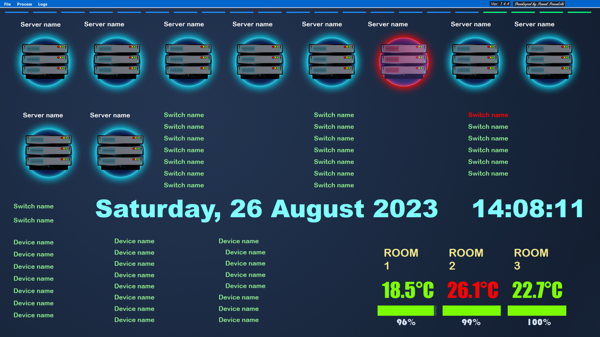
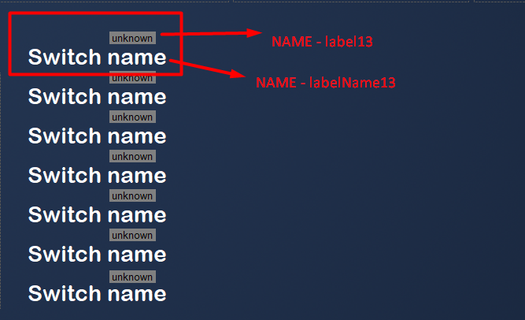

# Server Status 


This program is used to monitor crucial IT infrastructure equipment (servers, switches, DVRs) and shows temperature at key locations to enhance the IT department reaction to failures.  
If anything stops working, the text/icon turns red and an audio alert is generated.  
You need to install a large monitor in the IT office and connect to it a PC that will be constantly running (you can use an HDMI to Ethernet converter if your PC is far away, like in my case).  
In addition, each event is saved to a log file so you can check if something happened during the night, or review how many times a particular device had problems.  
The app also shows the battery level of the sensor.  
If the temperature reaches the limit specified in the code, the temp colour will turn red and there will also be a sound alert.  
The program is adapted to work with a monitor with a resolution of 2560x1440



# Background of the app

This is my first application I ever created.  
After completing a C++ course, my first idea was to create an application that would help my department respond quickly to breakdowns, even before reports from users (at the time of creating this application, I was working as IT support in a large factory).  
I am aware that the code of this application is far from perfect, many things can be improved or done differently. Over time I added a few things (such as temperature feature) and in these places the code should be a little better. I decided to leave it as it is for myself, for the future, so that in some time I can see what progress I have made (or until I have a need to implement major modifications).  
Developing this application allowed me to learn the basics of the C# as well as how to use Visual Studio. In addition, it helped me understand how to work with IoT devices - temperatures are obtained by using the MQTT protocol used to connect to Cisco sensors.

# Used technologies

- C# (Threading, JSON)
- IoT - MQTT protocol (M2Mqtt)

# How to use

To run this, you just need to put your IP addresses in the array "ip" and replace the names on the form

```C#
string[] ip = new string[]
        {
            "localhost",     // your device name
            "localhost",     // your device name
            "localhost",     // your device name
            "localhost",     // your device name
            "localhost",     // your device name
            "localhost",     // your device name
        };
```
Select Process -> Start and the program will start pinging each device one by one every second.  
Rectangles at the top change colour every time a Ping command is sent, so that you know the program is working.  
If you use less hardware, my solution is to change IP to localhost and set the name on the form as invisible.  
If you have a large amount of equipment, you should first add the IP to the array "ip" and then add a label on the form according to the pattern label+number - the number of IP addresses in the array "ip" must match the number of labels (labels are matched in pairs)



If you want to change the critical temperature then you need to change it for each device separately, line 350, 381 and 412
```C#
if (temp.celsius >= 25)
{
    if (labelWanTemp.ForeColor == Color.Chartreuse)
    {
        playerHighTemp.Play();
    }
    labelWanTemp.ForeColor = Color.Red;
}
else
{
    labelWanTemp.ForeColor = Color.Chartreuse;
}
```

# Credits

Kudos for the sounds 

- temperature sound  
Sarah-Christin Freytag  
https://freesound.org/people/xpoki/sounds/500760/

- online/offline sounds  
tim.kahn  
https://freesound.org/people/tim.kahn/sounds/45989/